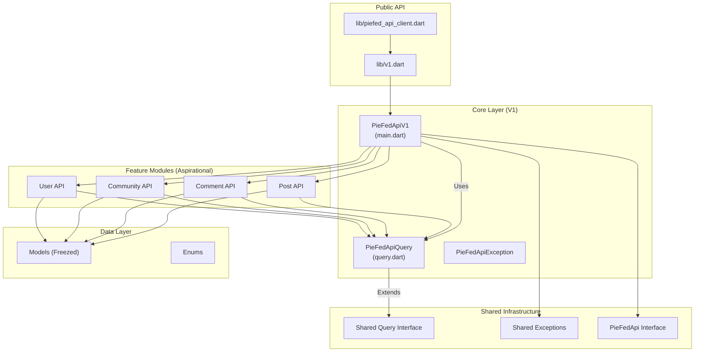

# PieFed API Client Architecture

A comprehensive architecture overview of the `piefed_api_client` Dart package.

## Overview

This client provides a statically-typed, Future-based interface for the [PieFed API](https://piefed.social/). It is designed with modularity and testability in mind, following Clean Architecture principles.



---

## Directory Structure

```
lib/
├── piefed_api_client.dart     # Main export
├── v1.dart                    # Export for V1 specific API
└── src/
    ├── shared/                # Version-agnostic utilities
    │   ├── exceptions.dart    # PieFedApiException
    │   ├── query.dart         # Base query interface
    │   └── piefed_api.dart    # Abstract client interface
    └── v1/                    # V1 Implementation
        ├── main.dart          # PieFedApiV1 client implementation
        ├── query.dart         # V1 specific query re-exports
        ├── api/               # API endpoint definitions (Aspirational)
        │   ├── api.dart       # Barrel file
        │   ├── post.dart
        │   ├── comment.dart
        │   └── ...
        ├── enums/             # API enum types
        │   └── enums.dart
        └── models/            # Data models (Freezed)
            └── models.dart
```

---

## Core Components

### 1. PieFedApiV1 Client

The main V1 client, located in `lib/src/v1/main.dart`.

```dart
class PieFedApiV1 implements PieFedApi {
  final String host;
  final http.Client _client;     // Injectable HTTP client
  final Duration timeout;         // Configurable timeout
  
  PieFedApiV1(this.host, {http.Client? client, ...});
  
  Future<T> run<T>(PieFedApiQuery<T> query) async { ... }
}
```

**Key Features:**
- **Dependency Injection**: Accepts an `http.Client` for better testability and connection pooling.
- **Unified Error Handling**: Wraps all errors in `PieFedApiException`.
- **Type Safety**: Uses generic `PieFedApiQuery<T>` to ensure correct return types.
- **Versioned**: Specifically targets V1 endpoints (`/api/v1/...`).

### 2. Query Pattern

The client uses the Command pattern where every API request is an object.

```dart
abstract class PieFedApiQuery<T> {
  String get path;
  HttpMethod get httpMethod;
  Map<String, dynamic> toJson();
  T responseFactory(Map<String, dynamic> json);
}
```

### 3. Data Models (Aspirational)

All models should be immutable and generated using [Freezed](https://pub.dev/packages/freezed).

```dart
@freezed
class Post with _$Post {
  const factory Post({
    required int id,
    required String title,
    // ...
  }) = _Post;
  
  factory Post.fromJson(Map<String, dynamic> json) => _$PostFromJson(json);
}
```

---

## Future Roadmap & Aspirational Patterns

### Feature Modules
The API surface should be broken down into feature-specific modules (e.g., `Post`, `Comment`, `User`). This keeps the codebase organized and prevents a single file from becoming too large.

### Response Envelopes
If the API returns wrapped responses (e.g., `{ "status": "success", "data": ... }`), the `responseFactory` should handle unwrapping logic centrally or within specific queries.

### Authentication
Authentication should be handled transparently. The client should accept an auth token (or credentials) and automatically attach it to requests.

### Pagination
Pagination helpers (e.g., `PagedQuery`) could be implemented to standardise list fetching.

### Error Handling
Detailed mapping of server error codes to specific exception subclasses (e.g., `PieFedAuthException`, `PieFedNotFoundException`) to allow consumers to react to specific failures.
